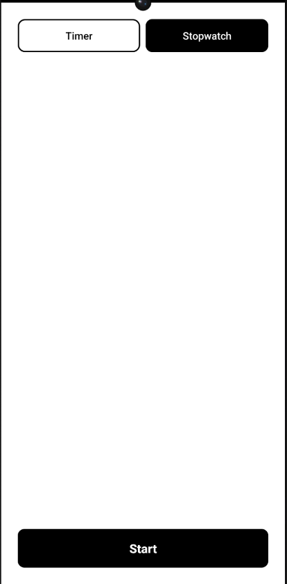

# Mudita Timer

A minimalist countdown timer for the [Mudita Kompakt](https://mudita.com/products/phones/mudita-kompakt/) — a distraction-free E Ink® phone built for less screen time, essential features, and a privacy focus.

---

## Features

- **Two modes** — countdown timer and stopwatch, switchable from the setup screen
- **Three presets** — 5, 10, and 25 minutes, one tap to start
- **Custom duration** — set minutes (0–99) and seconds (0–59) via simple +/− pickers
- **Stopwatch** — MM:SS display, pause and resume, reset to zero
- **Runs in the background** — a foreground service keeps the timer accurate when the screen is off or the app is backgrounded
- **Pause and resume** — picks up exactly where you left off
- **Audible alarm** — a single clean tone when the timer ends, nothing more
- **No distractions** — no notifications beyond the required foreground service notice, no history, no settings, no accounts
- **Fully offline** — no network calls, no analytics, no permissions beyond what is necessary

---

## Screenshots





---

## Sideloading to Mudita Kompakt

The Kompakt does not have an app store. Apps are installed via [Mudita Center](https://mudita.com/products/apps/mudita-center/), the desktop companion app.

1. Download `app-release.apk` from the [Releases](../../releases) page
2. Connect your Kompakt to your computer via USB-C
3. Open Mudita Center and wait for the device to appear
4. Navigate to **Manage Files → App Installers → Add App Files**
5. Select the downloaded APK and confirm
6. The app appears in your Kompakt's app list as **Mudita Timer**

---

## Building from Source

**Requirements**

- JDK 17
- Android SDK (platform 34, build-tools 34.0.0)
- A signing keystore (see below)

**First-time setup**

```bash
git clone https://github.com/jppelt/mudita-timer.git
cd mudita-timer
git checkout claude/eink-countdown-timer-app-cG5Mx

# Download the Gradle wrapper and Android SDK (Fedora / Ubuntu)
chmod +x bootstrap.sh
./bootstrap.sh
```

**Create a signing keystore**

```bash
keytool -genkey -v \
  -keystore ~/mudita-timer.jks \
  -keyalg RSA -keysize 2048 -validity 10000 \
  -alias mudita-timer \
  -dname "CN=Mudita Timer, O=Personal, C=US"

cp keystore.properties.template keystore.properties
# Edit keystore.properties with your keystore path and passwords
```

**Build**

```bash
# Debug APK (no signing config required)
./gradlew assembleDebug

# Release APK (requires keystore.properties)
./gradlew assembleRelease
```

The APK is written to `app/build/outputs/apk/`.

---

## Design

Mudita Timer is built around three [Mudita Mindful Design](https://mudita.com/community/blog/introducing-mudita-mindful-design/) principles:

**Readability** — Large monospace digits, pure black on white, no grays. Every element is legible on an E Ink display without squinting.

**Simplicity** — One screen per task. No menus, no history, no configuration beyond what the timer actually needs.

**Energy efficiency** — No animations anywhere in the UI. The screen updates once per second while the timer runs and is otherwise still. No network calls, no wakelocks.

---

## Technical notes

- Version: 1.2.0
- Language: Kotlin
- Minimum SDK: 28 (Android 9)
- Target SDK: 31 (Android 12 — matches MuditaOS K)
- No external dependencies beyond the Android framework
- No `INTERNET` permission
